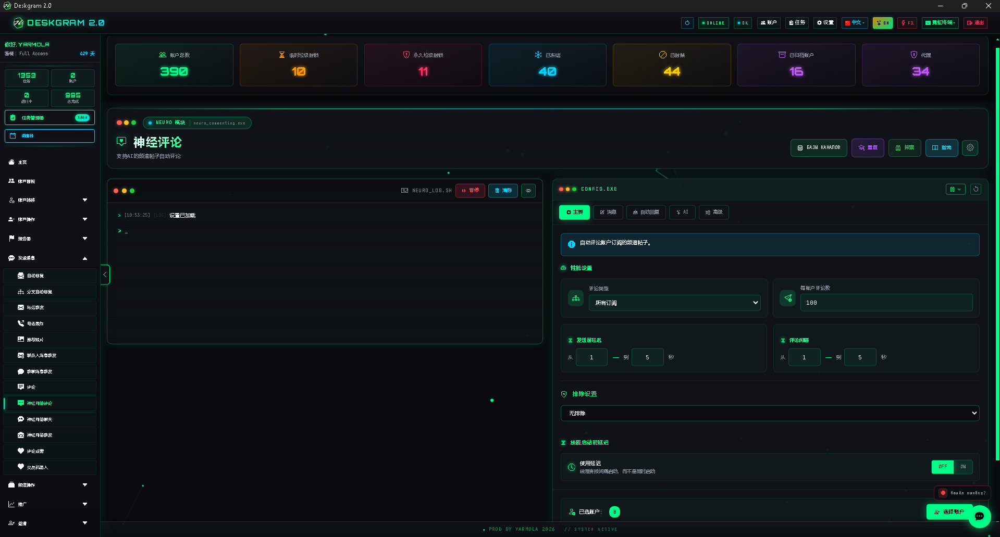
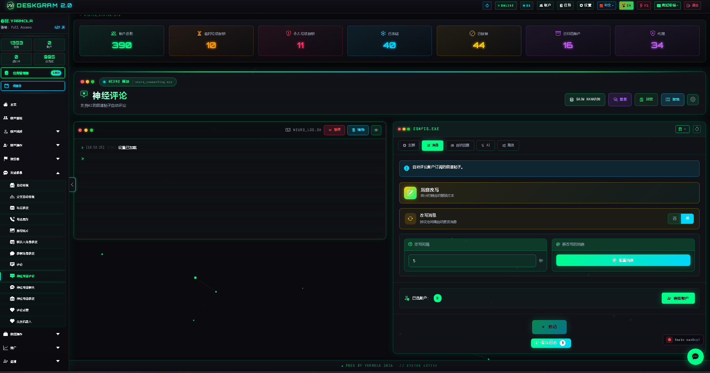
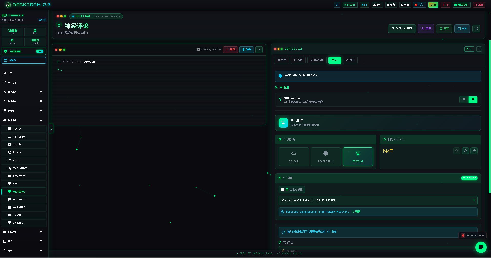
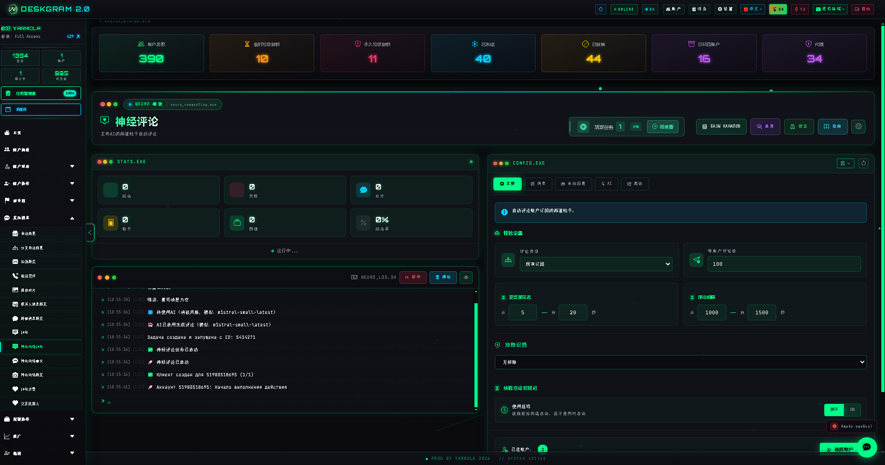

# Deskgram 2 神经评论

神经评论是 Deskgram 2 中用于 Telegram 新帖自动评论的模块。它把帖子监听、模板评论、AI 改写、内容生成、限额、延迟、讨论区进入和后续回复逻辑放在同一个流程里。

[Deskgram 2 中文总览](https://github.com/Deskgram-2/deskgram-2-telegram-automation-zh) | [官网](https://deskgram2.com/) | [Telegram Bot](https://t.me/DG2welcomebot) | [Web Preview](https://deskgram2.com/web-preview)

## 模块简介

| 参数 | 内容 |
|---|---|
| 核心任务 | 对 Telegram 频道新帖子进行自动评论 |
| 文本来源 | 模板、改写模式或基于帖子内容的 AI 生成 |
| 适用场景 | Telegram 营销、互动提升、账号活跃度维护 |
| 重要设置 | 评论类型、限额、延迟、讨论区、自动回复 |
| 关联模块 | 私信群发、受众收集 |

## 模块能力

- 监听 Telegram 频道中的新帖子；
- 按订阅范围或自定义频道列表执行；
- 使用模板或 AI 生成评论；
- 在发送前对文本做改写和变化；
- 需要时自动进入讨论区；
- 对后续回复接入自动回复逻辑；
- 输出日志和统计结果。

## 快速开始

1. 选择全部订阅或自定义频道列表。
2. 设置限额、延迟和排除规则。
3. 选择模板、改写或 AI 评论模式。
4. 需要时启用讨论区处理和自动回复。
5. 分配账号并启动任务。

## 建议一起使用的模块

- [账号面板](https://github.com/Deskgram-2/telegram-account-manager-deskgram-zh)，如果你需要先整理工作账号网格。
- [设置](https://github.com/Deskgram-2/telegram-automation-settings-deskgram-zh)，如果场景依赖 AI 提供商和系统级参数。
- [私信群发](https://github.com/Deskgram-2/telegram-direct-messaging-deskgram-zh)，如果评论之后要继续进入私聊沟通。
- [受众收集](https://github.com/Deskgram-2/telegram-audience-parser-deskgram-zh)，如果你还在搭建后续流程的数据基础。

## 这个模块之后常见的延伸路径

- [任务管理器](https://github.com/Deskgram-2/telegram-task-manager-deskgram-zh)，如果你要集中观察错误、节奏和执行结果。
- [批量订阅](https://github.com/Deskgram-2/telegram-join-groups-deskgram-zh)，如果评论前后都要先准备社区环境。
- [邀请模块](https://github.com/Deskgram-2/telegram-invite-tool-deskgram-zh)，如果评论活动属于更大的增长链路。
- [代理管理](https://github.com/Deskgram-2/telegram-proxy-manager-deskgram-zh)，如果稳定性依赖基础设施层。

## 界面亮点

### 主界面

### 文本与评论构建

### AI 设置

### 统计信息

## 适合在什么情况下使用

- 当你需要对新帖子保持持续互动；
- 当固定模板不够，需要 AI 变化文本时；
- 当你希望把限额、节奏和评论流程放进一个界面；
- 当评论只是后续私聊或回复流程的第一步。

## 相比手动评论更方便的地方

| 手动方式 | Deskgram 2 神经评论 |
|---|---|
| 需要自己盯着新帖子 | 模块会持续跟踪帖子流 |
| 评论很快变得重复 | AI 和改写逻辑提供变化 |
| 限额和节奏难以把控 | 界面里可直接配置限额和延迟 |
| 多账号扩展很混乱 | 工作流天然支持账号网格 |
| 后续回复容易丢失 | 可继续接入自动回复逻辑 |

## 相关仓库

- [Deskgram 2 中文总览](https://github.com/Deskgram-2/deskgram-2-telegram-automation-zh)
- [私信群发](https://github.com/Deskgram-2/telegram-direct-messaging-deskgram-zh)
- [受众收集](https://github.com/Deskgram-2/telegram-audience-parser-deskgram-zh)
- [账号面板](https://github.com/Deskgram-2/telegram-account-manager-deskgram-zh)
- [设置](https://github.com/Deskgram-2/telegram-automation-settings-deskgram-zh)
- [任务管理器](https://github.com/Deskgram-2/telegram-task-manager-deskgram-zh)
- [批量订阅](https://github.com/Deskgram-2/telegram-join-groups-deskgram-zh)
- [邀请模块](https://github.com/Deskgram-2/telegram-invite-tool-deskgram-zh)
- [代理管理](https://github.com/Deskgram-2/telegram-proxy-manager-deskgram-zh)

## FAQ

### 一定要使用 AI 吗？

不一定。模板评论也可以独立工作，AI 只是增强变化和上下文适配的附加层。

### 可以只针对指定频道吗？

可以。模块支持按预先准备的频道列表执行。
